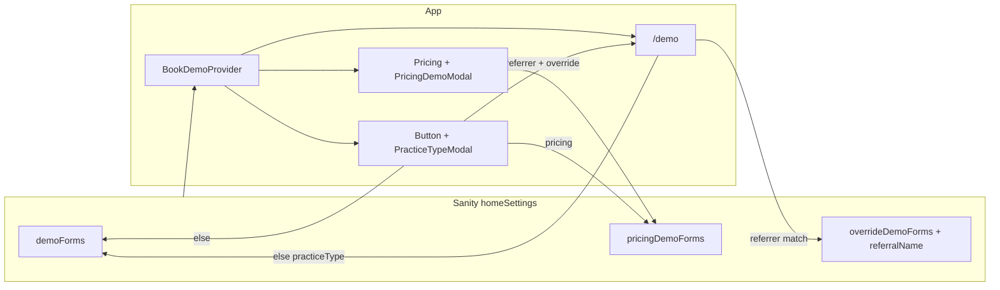

# Demo forms overview

How **demo forms**, **pricing demo forms**, and **override demo forms** work in this codebase.

## Data source (Sanity `homeSettings`, per language/region)

`getDemoFormData` (`src/lib/sanity.queries.ts`) loads one `homeSettings` document for the current locale and returns:

| Field | Role |
|--------|------|
| **Legacy singles** | `demoFormId`, `demoMeetingLink` (and related) — fallback when arrays do not match |
| **`demoForms[]`** | Per **practice type** (Dental, Optometry, …): `demoFormId` and/or `demoMeetingLink` — used for **general** “book demo” flows and **`/demo`** |
| **`pricingDemoForms[]`** | Same shape — used **only on the pricing page** (modal + practice-type picker) |
| **`overrideDemoForms[]`** | Same fields **plus `referralName`** — used when `?referrer=<referralName>` matches |

That payload is passed into `_app` as `demoFormData` and exposed app-wide via **`BookDemoContextProvider`** (`useDemoFormData()`).

Schema: `src/schemas/HomeSettings/index.tsx` (groups **Demo Forms**, **Pricing Demo Forms**).

---

## `/demo` page (`src/pages/demo/index.tsx`)

Resolution order:

1. If `referrer` is in the query **and** an entry in `overrideDemoForms` has `referralName === referrer` → use that row (HubSpot form ID or meeting embed).
2. Else use `demoForms`: match `practiceType` from `?practiceType=` (default **`Dental`**), else first item, else legacy `demoFormId` / `demoMeetingLink`.

**AU/UK:** a `useEffect` strips `practiceType` from the URL when appropriate, while keeping other query params (e.g. `referrer`).

**Rendering:** `HubSpotForm` if `formId`, `HubSpotMeeting` if `meetingLink`. `followUpMeetingLink` on the form still comes from top-level `formData.demoMeetingLink` (not necessarily the active row).

---

## Pricing page demo

- Uses **`pricingDemoForms`** only — not `demoForms`, and **not** `overrideDemoForms` inside `PricingDemoModal`.
- Pricing registers **`setPricingDemoModalCallback`** (`src/utils/pricingDemoModal.ts`) so “Book free demo” can open **`PricingDemoModal`** with a chosen practice type instead of navigating to `/demo`.
- **`PracticeTypeModal`** and **`Button`** branch: on pricing → `pricingDemoForms` for available practice types; off pricing → `demoForms`.

So **pricing** and **/demo** can show **different** HubSpot forms/meetings for the same practice type if CMS rows differ.

---

## `overrideDemoForms` (referrer campaigns)

- Each item has **`referralName`** (string you put in the URL as `referrer`).
- **`Button`** (“book free demo”): if the URL has `referrer` and a matching override exists, it **skips the practice-type modal** and navigates to `/demo` with `referrer` preserved (and cleans `flag` / `slug`).
- **`/demo`**: same `referrer` → picks that override row for the actual form/meeting.

**Note:** The **pricing modal** path does not consult overrides — only the global button → `/demo` shortcut and the demo page resolution do.

---

## Flow diagram

---

## Key files

| Area | File |
|------|------|
| GROQ fetch | `src/lib/sanity.queries.ts` — `getDemoFormData` |
| Context / types | `src/providers/BookDemoProvider.tsx` |
| Demo page | `src/pages/demo/index.tsx` |
| Pricing + modal wiring | `src/pages/pricing/index.tsx` |
| Pricing modal forms | `src/v2/components/common/PricingDemoModal.tsx` |
| Practice type modal | `src/v2/components/common/PracticeTypeModal.tsx` |
| Book demo CTA logic | `src/components/common/Button.tsx` |
| Sanity schema | `src/schemas/HomeSettings/index.tsx` |
